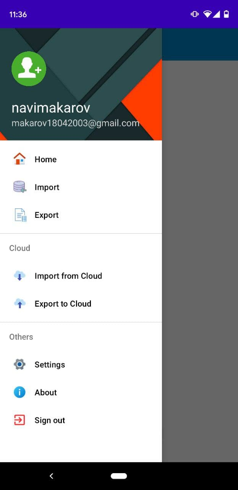

# WonderfulNotes
#### Description
A simple application for taking notes and managing daily tasks.
#### Features available
 :white_check_mark: Creating/Editing/Removing notes
  
 :white_check_mark: Highlight option
  
 :white_check_mark: Database Export/Import
  
 :white_check_mark: Simple User Interface
#### App Screenshots
<table>
  <tr>
    <td>First Screen Page</td>
     <td>Menu page</td>
  </tr>
  <tr>
    <td></td>
    <td></td>
  </tr>
 </table>
  
<table>
  <tr>
    <td>Remove a note</td>
     <td>Create a note</td>
  </tr>
  <tr>
    <td></td>
    <td></td>
  </tr>
 </table>

 <table>
  <tr>
    <td>Ask permission</td>
     <td>Export database</td>
  </tr>
  <tr>
    <td></td>
    <td></td>
  </tr>
 </table>

 <table>
   <tr>
     <td>Horizontal View</td>
  </tr>
  <tr>
    <td></td>
  </tr>
 </table>

 <table>
  <tr>
    <td>Error</td>
     <td>Database folder</td>
  </tr>
  <tr>
    <td></td>
    <td></td>
  </tr>
 </table>

#### TODO
:small_red_triangle_down:: FireBase accounts
 
:small_red_triangle_down: Login page
 
:small_red_triangle_down: Custom openFileDialog
 
:small_red_triangle_down: FireBase database import/export
 
:small_red_triangle_down: About and Settings fragments 
 
